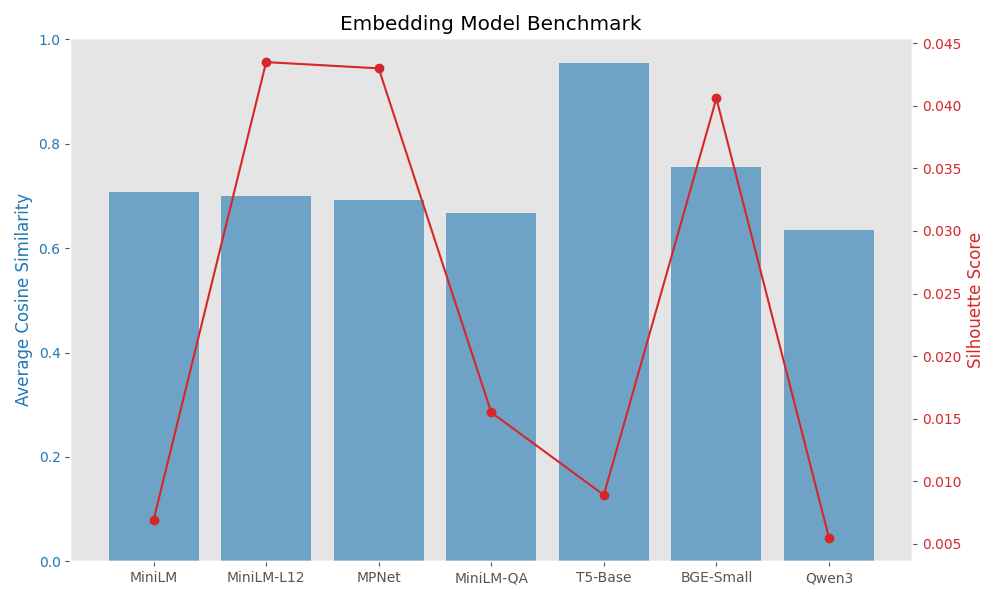

# 🧠 Legal Embedding Benchmark Tool


A local benchmarking tool for evaluating the performance of popular sentence embedding models on legal documents.

---

## 📘 Overview

This project evaluates different sentence embedding models using legal PDFs. It measures:

- ✅ **Model load time**
- ✅ **Embedding time**
- ✅ **Average pairwise cosine similarity**
- ✅ **Silhouette score** (clustering quality)

Use this tool to determine which embedding model best balances performance, accuracy, and efficiency on your document corpus.

---

## 📂 Supported Inputs

- 📄 PDFs from paths in `config.ini` (auto-discovers recursively)
- 🧠 Embedding model list via `embeddings.json`
- 🔧 Directory settings via `config.ini`

---

## 📊 Outputs

- `embedding_results.csv`: Benchmarked metrics per model
- 📷 `embedding_plot.png`: Bar + line chart showing similarity and clustering
- Console output with top models via CLI

---

## ⚙️ Configuration

### `config.ini`

```ini
[paths]
MODEL_PATH = 
PDF_PATH = []
```

> 🧠 Supports multiple folders via JSON list format

### `embeddings.json`

Example:

```json
[
  {
    "name": "MiniLM",
    "path": "sentence-transformers/all-MiniLM-L6-v2",
    "type": "sentence_transformer",
    "max_tokens": 500
  },
  {
    "name": "Qwen3",
    "path": "Qwen/Qwen3-Embedding-0.6B",
    "type": "qwen3",
    "max_tokens": 8192,
    "prompt_name": "query"
  }
]
```

---

## 🧰 Requirements

```txt
PyMuPDF
torch
pandas
numpy
scikit-learn
sentence-transformers
configparser
matplotlib
```

Install:

```bash
pip install -r requirements.txt
```

---

## 🚀 Run Benchmark

```bash
python test_embedding.py
```

Results saved to `embedding_results.csv`

---

## 🖼️ Plot Results

```bash
python plot_results.py
```

Generates a dual-axis chart:



---

## 🧮 CLI: Show Top Models

```bash
python cli.py
```

Customize in `cli.py` to sort by cosine similarity or silhouette score.

---

## 📈 Metrics Explained

| Metric             | Meaning                                                  |
|--------------------|----------------------------------------------------------|
| `load_time_sec`    | Time to load the model                                   |
| `embed_time_sec`   | Time to embed the documents                              |
| `avg_cos_sim`      | Average pairwise similarity between all document vectors |
| `silhouette`       | Measures clustering separability (higher = better)       |

---

## 📤 Upload to GitHub

```bash
git init
git add .
git commit -m "Initial benchmark tool"
git branch -M main
git remote add origin https://github.com/untucked/test-local-embedding.git
git push -u origin main
```

---

## 📄 License

MIT © 2024
